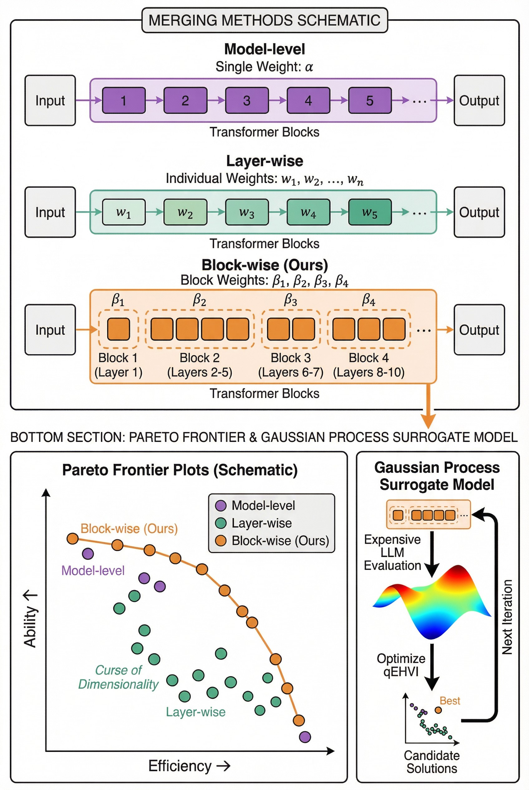
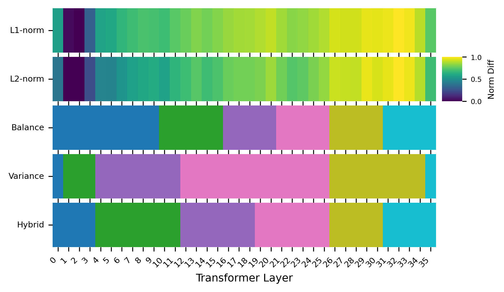
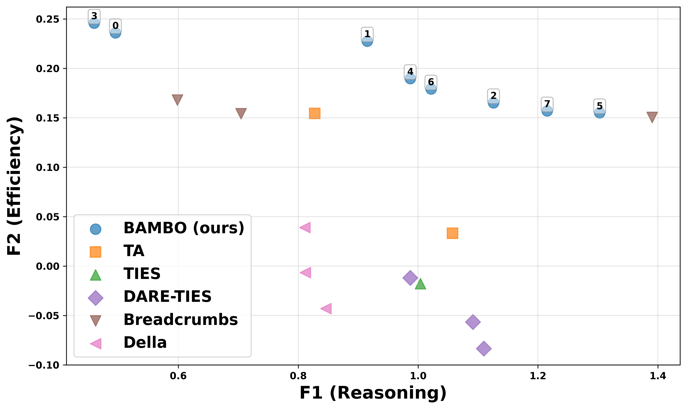

# BAMBO: Construct Ability and Efficiency LLM Pareto Set via Bayesian Adaptive Multi-objective Block-wise Optimization

<div align="center">

<!-- 替换为您的 Arxiv 链接 -->
[](https://arxiv.org/abs/25XX.XXXXX)
[](https://opensource.org/licenses/MIT)
[](https://www.python.org/downloads/release/python-390/)

**Kesheng Chen, Wenjian Luo*, Zhenqian Zhu, Yamin Hu, Yiya Xi**

*Guangdong Provincial Key Laboratory of Novel Security Intelligence Technologies, School of Computer Science and Technology, Harbin Institute of Technology, Shenzhen, China.*

\* Corresponding Author

</div>

---

## 📖 Abstract

Constructing a Pareto set is pivotal for navigating the capability-efficiency trade-offs in Large Language Models (LLMs). However, existing merging techniques remain inadequate: coarse-grained **model-level** methods yield sparse suboptimal solutions, while fine-grained **layer-wise** approaches suffer from the "curse of dimensionality."

To resolve this, we propose **BAMBO** (**B**ayesian **A**daptive **M**ulti-objective **B**lock-wise **O**ptimization). BAMBO renders the search tractable by introducing a **Hybrid Optimal Block Partitioning** strategy. This strategy leverages a **Dynamic Programming (DP)** approach to optimally balance intra-block homogeneity and inter-block information distribution, dramatically reducing dimensionality without sacrificing critical granularity. The process is automated within an evolutionary loop driven by the **q-Expected Hypervolume Improvement (qEHVI)** acquisition function.

<div align="center">
  
  <br>
  <em>Figure 1: Schematic comparison of Pareto frontiers. BAMBO achieves a denser and superior frontier compared to model-level and layer-wise approaches.</em>
</div>

## 🔥 Key Features

- **Hybrid Optimal Block Partitioning**: A novel partitioning strategy formulated as a 1D clustering problem. It uses Dynamic Programming to balance **Homogeneity** (grouping similar layers) and **Balance** (equalizing information mass), overcoming the limitations of greedy or uniform splitting.
- **Normalized Objective Function**: A principled scoring method anchored by "Expert" and "Base" models, ensuring fair and stable trade-offs between conflicting goals (e.g., Reasoning vs. Efficiency).
- **Bayesian Evolutionary Framework**: Automates the discovery of optimal block-level interpolation weights using Gaussian Process surrogates and qEHVI, efficiently navigating the search space.

## 🧠 Methodology

### 1. Hybrid Optimal Block Partitioning
Unlike naive layer grouping, BAMBO analyzes the task vector differences between models. We visualize the layer-wise L1/L2 norm differences and apply our DP algorithm to find the optimal cuts.

<div align="center">
  
  <br>
  <em>Figure 2: Layer-wise differences and the resulting block partition. The Hybrid strategy (bottom row) successfully isolates highly active deep layers while maintaining balanced information distribution.</em>
</div>

### 2. Optimization Loop
The framework iteratively:
1.  **Partitions** layers into blocks using the Hybrid Strategy.
2.  **Initializes** a warm-start population.
3.  **Optimizes** using Bayesian Optimization (GP + qEHVI) to find the best block-wise merging weights.

## 📊 Experiments & Results

We evaluated BAMBO on rigorous benchmarks including **GPQA-Diamond** and **AIME25**, fusing a "Thinking" model with an "Instruct" model.

<div align="center">
  
  <br>
  <em>Figure 3: Distribution of merged models in the objective function space. BAMBO (Red stars) dominates the collective Pareto frontier formed by baselines like Task Arithmetic, TIES, and DARE.</em>
</div>

**Critical Observation:** Searching for model-level fusion weights via fine-grained grid search is insufficient. Fine-grained weight settings, such as our hybrid optimal block-wise strategy, are essential for uncovering the true Pareto frontier.

## 🛠️ Code

The code for BAMBO is currently being organized and will be released soon.

- [ ] Release core block partitioning algorithm (DP implementation).
- [ ] Release Bayesian Optimization loop (based on BoTorch/Ax).
- [ ] Release evaluation scripts for GPQA and AIME25.

> **Stay Tuned!** Watch this repository for updates.

## 🔗 Citation

If you find this work useful in your research, please consider citing:

```bibtex
@article{chen2025bambo,
  title={BAMBO: Construct Ability and Efficiency LLM Pareto Set via Bayesian Adaptive Multi-objective Block-wise Optimization},
  author={Chen, Kesheng and Luo, Wenjian and Zhu, Zhenqian and Hu, Yamin and Xi, Yiya},
  journal={arXiv preprint arXiv:25XX.XXXXX},
  year={2025}
}
```

## 📧 Contact

For any questions, please feel free to reach out to the authors or open an issue.

---
<div align="center">
  
</div>
